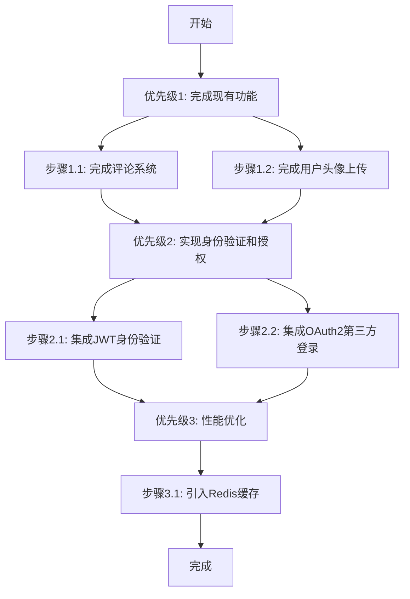

# “京淘商城”项目升级策略计划（简化版）

## 1. 项目分析概述
根据您的反馈，我了解到评论系统和用户头像上传功能尚未完成，JWT、OAuth2和Redis功能也还未实现。因此，本计划将专注于实现这些功能，以达到项目描述中的目标：
- 完成评论系统和用户头像上传功能。
- 实现JWT用于无状态身份验证。
- 实现OAuth2用于QQ/微信第三方登录授权。
- 引入Redis缓存热点数据，减少数据库访问压力。

## 2. 升级目标
- 实现评论系统，允许用户对商品发表评论。
- 完成用户头像上传功能，提升用户个性化体验。
- 集成JWT，实现安全的无状态身份验证。
- 集成OAuth2，支持QQ/微信第三方登录授权。
- 使用Redis缓存热点数据，提升接口响应速度。

## 3. 详细升级步骤（按优先级排列）
以下是升级步骤的详细计划，每个步骤都包含具体的任务和适合初学者的解释：

**优先级1：完成现有功能**
- **步骤1.1：完成评论系统**
  - 任务：在后端创建评论相关的数据库表、Mapper、Service和Controller，实现评论的增删改查功能；在前端添加评论提交和显示页面。
  - 解释：评论系统是商城的重要功能，允许用户对商品发表意见。初学者可以通过MyBatisX工具生成基础代码，然后在前端使用表单收集用户输入，通过API发送到后端保存。
- **步骤1.2：完成用户头像上传功能**
  - 任务：完善`MallUserController.java`中的头像上传逻辑，确保文件保存路径正确；在前端添加头像上传界面，显示上传后的头像。
  - 解释：头像上传可以提升用户个性化体验。初学者需要确保后端正确处理文件上传，前端通过表单控件实现文件选择和上传。

**优先级2：实现身份验证和授权**
- **步骤2.1：集成JWT身份验证**
  - 任务：添加JWT依赖，配置JWT生成和验证逻辑，在用户登录成功后生成令牌，并在后续请求中验证令牌。
  - 解释：JWT是一种无状态身份验证方式，适合前后端分离项目。初学者可以通过Spring Security或自定义过滤器实现JWT，网上有许多简单的教程和示例代码。
- **步骤2.2：集成OAuth2第三方登录**
  - 任务：添加OAuth2依赖，配置QQ和微信的客户端ID和密钥，实现授权流程，获取用户信息并绑定到系统账户。
  - 解释：OAuth2允许用户通过第三方账号登录，减少注册步骤。初学者可以参考Spring Security OAuth2的文档，逐步配置授权服务器和回调逻辑。

**优先级3：性能优化**
- **步骤3.1：引入Redis缓存**
  - 任务：添加Redis依赖，配置Redis连接，在热点数据（如商品详情、分类列表）查询时使用Redis缓存，减少数据库访问。
  - 解释：Redis是一种内存数据库，可以显著提升数据读取速度。初学者可以通过Spring Data Redis库，使用简单的注解（如`@Cacheable`）实现缓存功能。

## 4. 升级流程图（Mermaid）
以下是升级步骤的流程图，清晰展示优先级和实施顺序：

## 5. 总结
以上简化计划专注于实现“京淘商城”项目描述中的目标功能，包括评论系统、用户头像上传、JWT、OAuth2和Redis。每个步骤都提供了具体的任务和解释，确保您作为初学者可以轻松理解和逐步实施。